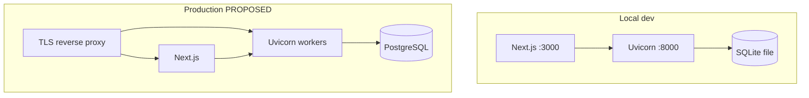

# Deployment architecture

```mermaid
flowchart TB
  subgraph dev [Local dev]
    Web[Next.js :3000]
    Api[Uvicorn :8000]
    Db[(SQLite file)]
    Web --> Api
    Api --> Db
  end

  subgraph prod [Production PROPOSED]
    Tls[TLS reverse proxy]
    WebP[Next.js]
    ApiP[Uvicorn workers]
    Pg[(PostgreSQL)]
    Tls --> WebP
    Tls --> ApiP
    WebP --> ApiP
    ApiP --> Pg
  end
```

See [operations/deployment.md](../operations/deployment.md) and root `docker-compose.yml`.
